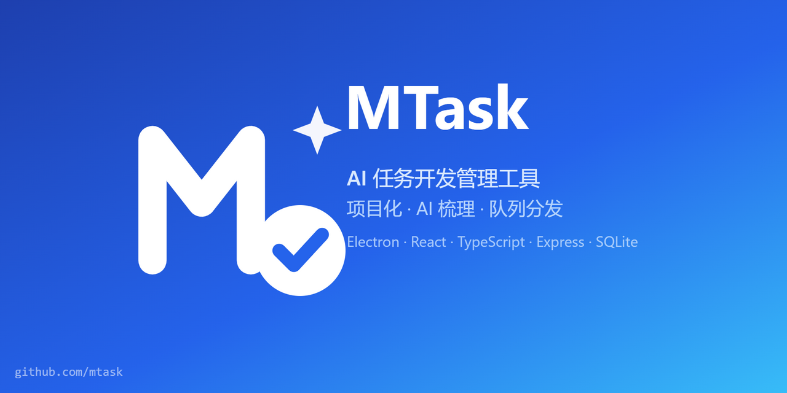

# MTask · AI 任务开发管理工具

<p align="center">
  
</p>

<div align="center">

[]()
[]()
[]()
[]()
[]()

</div>

替代基于 txt 的粗糙任务管理方式：按项目维度管理开发任务，AI 自动梳理任务内容，可配置多种 AI 开发工具，将每日任务队列发送给 AI 工具开发，完成归档可删。

> 技术选型：Electron（桌面壳）+ React 18 / Vite / TypeScript（前端）+ Express / TypeScript（后端）+ SQLite（better-sqlite3）。
> 关联文档：`需求规格说明书.md`、`同类产品分析报告.md`、`docs/技术设计.md`。

## 目录

```
server/   # 后端：Express + SQLite + AIAdapter（OpenAI 兼容 / Claude / Ollama）
web/      # 前端：React + Vite
electron/ # 桌面壳主进程（骨架阶段可跳过）
scripts/  # Windows 一键脚本（构建打包/启动服务/停止服务）
docs/     # 技术设计文档
```

## 开发运行

```bash
# 1. 安装依赖（根工作区一次装齐）
npm install

# 2. 启动后端（默认 http://127.0.0.1:39876，自动建库 server/data/mtask.db）
npm run dev:server

# 3. 另开终端启动前端（Vite dev server，/api 代理到后端）
npm run dev:web
# 浏览器打开 http://localhost:5173

# 类型检查
npm run typecheck
```

## Windows 一键脚本（scripts/）

与闲鱼猎人项目同款模式（GBK 编码，双击即用）：

| 脚本 | 作用 |
|------|------|
| `scripts\构建打包.bat` | 依赖检查/自动安装 + 类型检查 + 后端编译 + 前端构建 |
| `scripts\启动服务.bat` | 清理旧进程 → 启动后端(39876)+前端(5173) → 等待就绪 → 健康检查 → 打开浏览器 |
| `scripts\停止服务.bat` | PID 文件优先停止，端口扫描兜底，验证端口释放 |

PID 文件存于 `logs\`（server.pid / web.pid）。若修改端口，请同步改三个脚本中的 `SERVER_PORT` / `WEB_PORT`。

## 桌面壳（Electron）

```bash
# 前提：server/web 依赖已装、web 已构建
npm run build:web
npm run electron          # 生产模式：加载 web/dist，内嵌启动 server
# 或开发模式（前端走 Vite 热更新，需另开 npm run dev:server）
MTask_DEV=1 npm run electron
```

接入要点：
- 主进程内嵌启动后端（tsx 直跑 TS 源），`file://` 页面的 `/api/*` 请求由 `session.webRequest` 重定向到 `http://127.0.0.1:39876`，前端零改动；
- 后端已启用 CORS（本地服务放行），供桌面壳跨协议 fetch。

## 适配器联调验证（本地 mock）

无需外网/API Key 即可验证 AI 适配器的协议正确性（请求构造、解析、错误/超时路径）：

```bash
cd server/scripts
node mock-ai-server.mjs                          # 终端 1：模拟 OpenAI/Claude/Ollama/WorkBuddy 端点
node ../../node_modules/tsx/dist/cli.mjs adapter-e2e.mjs  # 终端 2：真实跑适配器代码，51 项断言
```

> 说明：适配器源码内部使用不带扩展名的相对导入（如 `./netutil`），Node 24 的 `--experimental-strip-types` 无法解析，
> 需用 workspace 根下的 tsx 运行（tsx 支持该写法）。若 tsx 未随根 `npm install` 装齐，可先补装。联调覆盖协议/解析/错误透传/超时，及 WorkBuddy 的异步提交（submit）+ 轮询收口（poll）。

## 主要功能入口（骨架阶段）

- **任务**：按项目建任务（可设优先级/描述/搜索），待办/已完成双列表，一键归档
- **AI 配置**：注册 AI 工具（OpenAI 兼容 / Claude / Ollama），密钥加密存储、测试连接、脱敏显示、**默认工具绑定**
- **队列**：新建今日队列，把待办任务+指定 AI 工具组队，发送后回执落库（仅保存文本），行展开审阅 + 采纳/复制
- **归档**：归档任务统一管理，可还原，仅归档任务可删除

## 功能与需求对照（验收辅助）

| 需求（SRS） | 实现位置 |
|-------------|----------|
| FR1.1 项目管理 | `server/routes` /projects；`web/pages/TasksPage` |
| FR1.2/1.3 任务创建/编辑 | `TaskService.create/update`；TasksPage 标题/描述/优先级 |
| FR1.4 列表视图+检索 | `GET /tasks?projectId&archived`；TasksPage 搜索框 |
| FR1.5 非归档禁删 | `ArchiveService.remove` 仅 `archived=1` |
| FR2  AI 梳理（单条/批量+确认回填） | `POST /api/ai/organize`；TasksPage 草稿→保存 |
| FR3.1–3.3 AI 工具配置 | `ConfigService`（加密/脱敏/连接测试） |
| FR3.4 默认工具绑定 | `POST /aitools/:id/set-default`；AIToolsPage |
| FR4.1–4.5 队列构建/发送/回执/重试 | `QueueService`（Job 状态机）；QueuePage |
| FR4.4 采纳=仅保存文本 | `POST /tasks/:id/adopt`（ai_summary+done） |
| FR5.1/5.3 完成/退回 | `TaskService.setStatus` |
| FR6.1–6.5 归档/还原/删除 | `ArchiveService`；ArchivePage |

## 环境变量

| 变量 | 说明 | 默认 |
|------|------|------|
| `MTask_PORT` | 后端端口 | 39876 |
| `MTask_DATA_DIR` | SQLite 数据目录 | `server/data` |
| `MTask_MASTER_KEY` | API Key 加密主密钥（生产必配） | 本机指纹派生（仅开发兜底） |
| `MTask_DEV` | Electron 加载 Vite dev server | 关闭 |
